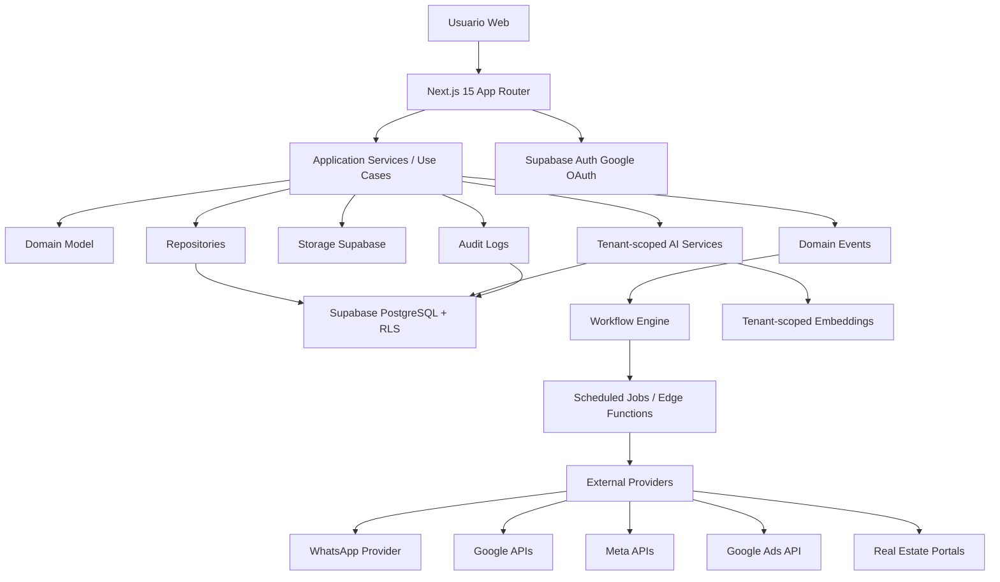

# InmoFlow CRM - FASE 1 - Arquitectura del Sistema

## 1. Objetivo de la fase

Definir la arquitectura completa de InmoFlow CRM como SaaS inmobiliario enterprise, multi-tenant estricto, preparado para produccion, con Supabase como backend principal, PostgreSQL como base de datos, Next.js 15 como frontend y despliegue GitHub -> Vercel.

Esta fase no implementa carpetas, SQL, backend, frontend ni integraciones. Su salida es la arquitectura tecnica y funcional que gobierna las fases siguientes.

## 2. Principios arquitectonicos

1. Multi-tenancy estricto por `tenant_id`.
2. Row Level Security obligatorio en todas las tablas de datos de negocio.
3. Ninguna consulta de negocio puede ejecutarse sin alcance de tenant.
4. Supabase Auth es la fuente de identidad.
5. PostgreSQL es la fuente de verdad transaccional.
6. Clean Architecture y DDD separan dominio, aplicacion, infraestructura y presentacion.
7. Integraciones externas se encapsulan por adaptadores reales, con tokens cifrados y auditoria.
8. La IA solo puede operar sobre datos autorizados del tenant activo.
9. Automatizaciones y workflows se ejecutan con eventos persistidos, idempotencia y trazabilidad.
10. Seguridad, auditoria, validacion y observabilidad son requisitos base, no capas opcionales.

## 3. Problemas criticos detectados antes de construir

### 3.1 Escalabilidad

El producto combina CRM, inmuebles, agenda, workflows, documentos, ads, mensajeria e IA. Si se implementa como una unica capa de acciones sin limites claros, crecera como monolito accidental dificil de operar.

Decision:

- Usar modular monolith en Next.js/Supabase para la primera version productiva.
- Separar dominios por modulos internos y contratos de aplicacion.
- Diseñar tablas, eventos y servicios para poder extraer workers o servicios especializados en el futuro sin romper el modelo.

### 3.2 Multi-tenancy

El mayor riesgo es una fuga de datos entre inmobiliarias. El filtrado solo desde frontend o services no es suficiente.

Decision:

- `tenant_id` obligatorio en toda entidad de negocio.
- RLS en todas las tablas.
- Politicas basadas en membresia activa del usuario dentro del tenant.
- Funciones SQL `security definer` revisadas solo para operaciones que lo requieran.
- Indices compuestos que empiecen por `tenant_id`.
- Repositories obligan `TenantContext` en toda operacion de negocio.

### 3.3 IA por tenant

La IA conversacional, recomendaciones y respuestas automaticas pueden filtrar datos si se comparten embeddings, historiales o contexto entre tenants.

Decision:

- Cada documento, embedding, conversacion, recomendacion y ejecucion de IA lleva `tenant_id`.
- Recuperacion RAG filtrada por tenant antes de construir el prompt.
- No se entrena ni consulta ningun indice global con datos mezclados.
- Logs de prompts y respuestas se almacenan con redaccion de secretos y alcance tenant.
- Politicas de retencion configurables por tenant.

### 3.4 Integraciones

WhatsApp, Gmail, Calendar, Google Ads, Meta Ads y portales inmobiliarios requieren credenciales reales, webhooks, renovacion de tokens, limites de API y manejo de errores.

Decision:

- No existirán integraciones simuladas.
- Cada integracion tendra un provider real, estado de conexion, scopes, token cifrado, auditoria y sincronizacion incremental.
- Las funcionalidades dependientes de credenciales se habilitan solo cuando el tenant complete la conexion OAuth/API correspondiente.
- Los conectores de portales se diseñan mediante contratos estables, aunque cada portal se implemente en fase posterior con credenciales y documentacion oficial.

### 3.5 Automatizaciones

Los workflows visuales necesitan ejecucion confiable. Ejecutarlos solo desde el cliente o como llamadas sueltas generaria duplicados y estados inconsistentes.

Decision:

- Modelo basado en definiciones versionadas de workflow.
- Eventos de dominio persistidos.
- Jobs idempotentes con claves de deduplicacion.
- Historial de ejecuciones por nodo.
- Separacion entre constructor visual, definicion serializada y motor de ejecucion.

### 3.6 Seguridad OWASP

El CRM tendra datos personales, comerciales, documentos, contratos y tokens de terceros.

Decision:

- Validacion Zod en limites de entrada.
- Autorizacion server-side en cada caso de uso.
- RLS como barrera de base de datos.
- Cifrado de tokens externos.
- Rate limiting por usuario, tenant, IP y tipo de operacion.
- Auditoria inmutable para acciones sensibles.
- CSP, headers de seguridad, proteccion CSRF donde aplique y sanitizacion de contenido generado.

## 4. Arquitectura de alto nivel

## 5. Plataformas obligatorias

### 5.1 Frontend

- Next.js 15 con App Router.
- TypeScript estricto.
- TailwindCSS.
- Shadcn UI.
- Server Components para lectura autenticada cuando sea conveniente.
- Server Actions o Route Handlers solo como capa de entrada, delegando en use cases.
- React Hook Form + Zod para formularios.
- TanStack Query solo para interacciones client-side con estado remoto complejo si el patron del modulo lo justifica.

### 5.2 Backend

- Supabase Auth para identidad.
- Supabase PostgreSQL para datos transaccionales.
- Supabase Storage para documentos, imagenes y archivos.
- Supabase Edge Functions para webhooks, jobs programados y operaciones que no deben vivir en el cliente.
- Next.js Route Handlers para BFF cuando la operacion necesita contexto web, cookies o composicion de casos de uso.

### 5.3 Infraestructura

- GitHub como repositorio fuente.
- GitHub Actions para lint, typecheck, tests, validacion de migraciones y despliegues controlados.
- Vercel para frontend Next.js.
- Supabase CLI para migraciones reproducibles.
- Variables de entorno separadas por ambiente: local, preview, production.

## 6. Modelo multi-tenant

### 6.1 Entidades base

- `tenants`: inmobiliarias u organizaciones.
- `tenant_memberships`: relacion usuario-tenant con rol, estado y permisos.
- `profiles`: perfil extendido del usuario autenticado.
- `roles`: Owner, Manager, Agent, Admin.
- `audit_logs`: eventos de auditoria por tenant.

### 6.2 Resolucion de tenant activo

El usuario puede pertenecer a uno o mas tenants. Toda operacion de negocio debe recibir un `TenantContext`:

- `tenantId`.
- `userId`.
- `role`.
- `permissions`.
- `membershipStatus`.

El tenant activo se resuelve server-side desde:

1. Sesion Supabase Auth.
2. Membresia activa en `tenant_memberships`.
3. Seleccion explicita de tenant cuando el usuario pertenece a varios.

### 6.3 Reglas de aislamiento

- No hay tablas de negocio sin `tenant_id`.
- No hay storage objects sin prefijo por tenant y metadata asociada.
- No hay embeddings sin `tenant_id`.
- No hay logs de IA sin `tenant_id`.
- No hay eventos ni jobs sin `tenant_id`.
- No hay dashboard ni metricas agregadas sin filtro por tenant.

## 7. Autenticacion y autorizacion

### 7.1 Autenticacion

- Google OAuth mediante Supabase Auth.
- Confirmacion de sesion con `@supabase/ssr`.
- No se almacenan contrasenas en la aplicacion.

### 7.2 Onboarding

Flujo productivo:

1. Usuario inicia sesion con Google.
2. Si no tiene perfil, se crea `profiles`.
3. Si no tiene tenant, puede crear organizacion y queda como Owner.
4. Si fue invitado, acepta invitacion y se crea membresia activa.
5. Toda navegacion posterior exige tenant activo.

### 7.3 Roles

- Owner: control total del tenant, facturacion futura, usuarios, integraciones y configuracion.
- Admin: administracion operativa avanzada, sin propiedad legal del tenant.
- Manager: gestion comercial, equipo, pipeline, metricas y asignaciones.
- Agent: operacion diaria de leads, inmuebles, visitas, tareas y comunicaciones asignadas.

La autorizacion se implementa en dos niveles:

- Politicas RLS para acceso a filas.
- Guards de aplicacion para permisos de acciones especificas.

## 8. Dominios DDD

### 8.1 Identity & Tenancy

Responsabilidades:

- Perfiles.
- Tenants.
- Membresias.
- Invitaciones.
- Roles y permisos.
- Tenant activo.

### 8.2 CRM Leads

Responsabilidades:

- Leads.
- Contactos.
- Estados.
- Origen del lead.
- Historial de interacciones.
- Scoring.
- Asignacion a agentes.
- Reactivacion.

### 8.3 Sales Pipeline

Responsabilidades:

- Pipelines configurables.
- Etapas.
- Oportunidades.
- Movimientos entre etapas.
- Probabilidad.
- Motivos de perdida.
- Forecast.

### 8.4 Properties

Responsabilidades:

- Inmuebles.
- Fichas tecnicas.
- Ubicacion y geolocalizacion.
- Multimedia.
- Disponibilidad.
- Precio, moneda, gastos y condiciones.
- Caracteristicas fisicas y comerciales.
- Publicacion.

### 8.5 Portfolio Sharing

Responsabilidades:

- Portafolios compartibles.
- Enlaces publicos firmados.
- Expiracion.
- Control de propiedades visibles.
- Registro de visualizaciones.

### 8.6 Scheduling

Responsabilidades:

- Visitas.
- Calendario.
- Tareas.
- Recordatorios.
- Sincronizacion Google Calendar.

### 8.7 Communications

Responsabilidades:

- Conversaciones.
- Mensajes.
- Canales: WhatsApp, Gmail.
- Plantillas.
- Respuestas automaticas.
- Seguimiento de leads.

### 8.8 Automation & Workflows

Responsabilidades:

- Constructor visual.
- Definiciones versionadas.
- Triggers.
- Condiciones.
- Acciones.
- Ejecuciones.
- Retries e idempotencia.

### 8.9 AI

Responsabilidades:

- Conversacion asistida.
- RAG por tenant.
- Generacion de respuestas.
- Recomendacion de propiedades.
- Reactivacion de leads.
- Generacion de contenido para redes.
- Generacion documental asistida.

### 8.10 Documents

Responsabilidades:

- Contratos.
- Recibos.
- Reservas.
- Plantillas documentales.
- Versionado.
- Exportacion.
- Firma futura.

### 8.11 Marketing & Ads

Responsabilidades:

- Google Ads.
- Meta Ads.
- Captura y atribucion de leads.
- Campañas.
- Creatividades.
- Metricas.

### 8.12 Analytics

Responsabilidades:

- Dashboard ejecutivo.
- Metricas comerciales.
- Conversion por etapa.
- Performance por agente.
- Fuente de leads.
- Tiempo de respuesta.
- Ocupacion de agenda.

### 8.13 Publishing

Responsabilidades:

- Publicacion de propiedades.
- Preparacion para Zonaprop, Argenprop y Mercado Libre Inmuebles.
- Validacion de requisitos por portal.
- Estados de publicacion.
- Sincronizacion y errores.

## 9. Clean Architecture

Cada modulo seguira esta separacion:

- Domain: entidades, value objects, reglas puras, eventos de dominio.
- Application: casos de uso, DTOs internos, puertos, autorizacion de accion.
- Infrastructure: repositories Supabase/PostgreSQL, providers externos, storage, logs.
- Presentation: pages, components, forms, route handlers, server actions.

Regla de dependencias:

- Presentation depende de Application.
- Application depende de Domain y puertos.
- Infrastructure implementa puertos.
- Domain no depende de frameworks.

## 10. Repository Pattern

Los repositories no aceptan operaciones sin `TenantContext` cuando trabajan con datos de negocio.

Contrato conceptual:

- `create(context, input)`.
- `findById(context, id)`.
- `list(context, filters)`.
- `update(context, id, input)`.
- `delete(context, id)`.

Reglas:

- Todo query incluye `tenant_id`.
- Todo insert asigna `tenant_id` desde el contexto server-side.
- El cliente nunca decide el tenant de una fila.
- Los filtros se validan con Zod antes de llegar al repository.

## 11. Service Layer y casos de uso

Los servicios de aplicacion orquestan:

- Validacion.
- Autorizacion.
- Reglas de negocio.
- Transacciones.
- Emision de eventos.
- Auditoria.
- Llamadas a providers externos.

No se permite que componentes UI llamen directamente a tablas de negocio para mutaciones complejas. Las mutaciones pasan por use cases server-side.

## 12. Modelo de datos conceptual

Grupos de tablas previstos para FASE 3 y FASE 4:

### Tenancy e identidad

- `tenants`
- `profiles`
- `tenant_memberships`
- `tenant_invitations`
- `role_permissions`

### CRM

- `lead_sources`
- `leads`
- `lead_contacts`
- `lead_assignments`
- `lead_activities`
- `lead_notes`
- `lead_scores`

### Pipeline

- `pipelines`
- `pipeline_stages`
- `opportunities`
- `opportunity_stage_history`

### Inmuebles

- `properties`
- `property_technical_specs`
- `property_locations`
- `property_media`
- `property_pricing`
- `property_availability`
- `property_publication_statuses`

### Agenda

- `appointments`
- `calendar_events`
- `tasks`
- `reminders`

### Comunicaciones

- `communication_channels`
- `conversations`
- `messages`
- `message_templates`
- `outbound_message_jobs`

### Automatizaciones

- `workflow_definitions`
- `workflow_versions`
- `workflow_triggers`
- `workflow_executions`
- `workflow_node_executions`
- `domain_events`

### IA

- `ai_knowledge_documents`
- `ai_embeddings`
- `ai_conversations`
- `ai_messages`
- `ai_recommendations`
- `ai_generation_logs`

### Documentos

- `document_templates`
- `documents`
- `document_versions`
- `document_signing_requests`

### Marketing e integraciones

- `integration_connections`
- `integration_tokens`
- `integration_sync_states`
- `ad_accounts`
- `campaigns`
- `ad_lead_imports`
- `portal_connections`
- `portal_publications`

### Analytics y auditoria

- `audit_logs`
- `rate_limit_events`
- `system_logs`
- `analytics_snapshots`

## 13. RLS obligatorio

Patron base de RLS para tablas tenant-scoped:

1. `tenant_id` no nulo.
2. Politica SELECT permite acceso si existe membresia activa del usuario en el tenant.
3. Politica INSERT permite crear solo dentro de tenant donde el usuario tenga permiso.
4. Politica UPDATE permite modificar solo dentro de tenant autorizado.
5. Politica DELETE restringida por rol y permiso.

Las tablas publicas controladas, como portafolios compartidos por enlace, no exponen datos directamente. Se usaran vistas o funciones controladas con tokens firmados, expiracion y registro de acceso.

## 14. Auditoria

Toda accion sensible genera `audit_logs`:

- Usuario.
- Tenant.
- Entidad.
- Accion.
- Valores anteriores y nuevos cuando corresponda.
- IP.
- User agent.
- Correlation ID.
- Fecha.

Acciones auditadas:

- Login y onboarding.
- Invitaciones y cambios de rol.
- Creacion, actualizacion y eliminacion de leads.
- Cambios de etapa.
- Cambios de precio o disponibilidad de inmuebles.
- Envio de mensajes.
- Conexion o desconexion de integraciones.
- Ejecuciones de workflow.
- Generacion de documentos.
- Acciones de IA con impacto operativo.

## 15. Logs y observabilidad

Se usara logging estructurado con:

- `tenant_id`.
- `user_id`.
- `correlation_id`.
- `module`.
- `operation`.
- `severity`.
- `duration_ms`.
- Resultado.

No se registran secretos, access tokens, refresh tokens ni datos personales innecesarios.

## 16. Rate limiting

Capas:

- Por IP para endpoints publicos.
- Por usuario para acciones autenticadas.
- Por tenant para IA, mensajes, integraciones y automatizaciones.
- Por provider externo respetando cuotas reales.

Operaciones especialmente limitadas:

- IA conversacional.
- Generacion de documentos.
- Envio WhatsApp/Gmail.
- Importacion de leads.
- Webhooks.
- Enlaces publicos de portafolio.

## 17. IA tenant-scoped

### 17.1 Flujo RAG

1. Validar usuario y tenant.
2. Validar permiso de accion.
3. Buscar conocimiento solo en documentos y embeddings del tenant.
4. Construir contexto con minimo dato necesario.
5. Ejecutar modelo.
6. Validar salida segun caso de uso.
7. Registrar generacion.
8. Devolver respuesta.

### 17.2 Recomendacion de propiedades

La recomendacion usa:

- Preferencias del lead.
- Historial de interacciones.
- Presupuesto.
- Zona.
- Tipo de operacion.
- Disponibilidad.
- Reglas comerciales del tenant.

Nunca recomienda propiedades de otro tenant.

### 17.3 Seguimiento y reactivacion

Los jobs de IA pueden proponer acciones, pero las acciones automaticas quedan sujetas a configuracion del tenant, limites y auditoria.

## 18. Integraciones reales

### 18.1 WhatsApp

Arquitectura prevista:

- Provider oficial compatible con WhatsApp Business Platform.
- Webhooks verificados.
- Plantillas aprobadas.
- Estado de entrega.
- Conversaciones asociadas a leads.
- Rate limiting por tenant y canal.

### 18.2 Gmail

Arquitectura prevista:

- Google OAuth con scopes minimos.
- Envio y lectura controlada segun permisos.
- Sincronizacion incremental.
- Asociacion de correos a leads.
- Revocacion y renovacion de tokens.

### 18.3 Google Calendar

Arquitectura prevista:

- Sincronizacion de visitas y eventos.
- Manejo de conflictos.
- Webhooks o polling incremental segun disponibilidad.
- Mapeo entre evento interno y evento Google.

### 18.4 Google Ads y Meta Ads

Arquitectura prevista:

- Conexion por tenant.
- Importacion de leads con atribucion.
- Sincronizacion de campañas y metricas.
- Manejo de cuentas publicitarias multiples.

### 18.5 Portales inmobiliarios

Arquitectura preparada para:

- Zonaprop.
- Argenprop.
- Mercado Libre Inmuebles.

Se definira un contrato comun de publicacion:

- Validar propiedad.
- Transformar ficha tecnica al formato del portal.
- Publicar.
- Sincronizar estado.
- Registrar errores.
- Despublicar.

La implementacion concreta dependera de credenciales, documentacion oficial y acuerdos de cada portal.

## 19. Seguridad OWASP

Controles base:

- Validacion de entrada con Zod.
- Escapado y sanitizacion de contenido HTML.
- Proteccion contra IDOR mediante RLS y `tenant_id`.
- Proteccion contra XSS mediante CSP y componentes seguros.
- Proteccion contra CSRF en mutaciones que dependan de cookies.
- Headers de seguridad.
- Secretos solo en variables de entorno server-side.
- Tokens externos cifrados en reposo.
- Menor privilegio para scopes OAuth.
- Errores sin filtracion de informacion sensible.

## 20. Estrategia de despliegue

Ambientes:

- Local.
- Preview por pull request.
- Production.

Pipeline:

1. GitHub recibe push.
2. GitHub Actions ejecuta lint, typecheck, tests y validacion de migraciones.
3. Vercel despliega preview.
4. Supabase migrations se aplican de forma controlada.
5. Produccion se promueve desde rama principal o release aprobada.

## 21. Variables de entorno previstas

Categorias:

- Supabase URL y anon key.
- Supabase service role key solo server-side y nunca en cliente.
- Google OAuth.
- Google APIs.
- WhatsApp provider.
- Meta APIs.
- Google Ads.
- IA provider.
- Cifrado de tokens.
- Rate limiting.
- Observabilidad.
- URLs publicas por ambiente.

Los nombres exactos se definiran durante FASE 6, FASE 8 y FASE 9 al implementar codigo e integraciones reales.

## 22. Testing y calidad

Capas:

- Typecheck estricto.
- ESLint.
- Prettier.
- Unit tests para dominio y casos de uso.
- Integration tests para repositories y RLS.
- Tests de autorizacion multi-tenant.
- Tests de formularios criticos.
- Tests de webhooks.
- Tests de workflows.

Pruebas obligatorias de tenancy:

- Usuario A de tenant A no puede leer tenant B.
- Usuario A de tenant A no puede insertar filas en tenant B.
- Usuario A de tenant A no puede modificar filas de tenant B.
- Enlaces publicos no exponen datos privados no incluidos en el portafolio.
- IA no recupera embeddings de otro tenant.

## 23. Decisiones de producto que afectan arquitectura

- El sistema sera configurable por tenant, no por instalacion.
- Los pipelines son definidos por tenant.
- Los workflows son definidos por tenant y versionados.
- Las integraciones son conectadas por tenant.
- Los datos de IA son aislados por tenant.
- Los portafolios compartidos son una superficie publica controlada, no una excepcion al modelo de seguridad.

## 24. Criterios de cierre de FASE 1

FASE 1 queda completa cuando:

1. Existe una arquitectura de alto nivel documentada.
2. Estan definidos los riesgos principales de escalabilidad, seguridad y multi-tenancy.
3. Estan definidos los dominios DDD.
4. Esta definido el patron Clean Architecture.
5. Esta definido el modelo de aislamiento por tenant.
6. Esta definido el enfoque de RLS.
7. Esta definido el enfoque de IA tenant-scoped.
8. Esta definido el enfoque de integraciones reales.
9. Esta definido el enfoque de despliegue GitHub -> Vercel.
10. No se ha generado codigo, carpetas de aplicacion, SQL ni integraciones antes de cerrar esta fase.

## 25. Estado

FASE 1 completada.

Siguiente fase permitida: FASE 2 - Generar estructura de carpetas.
