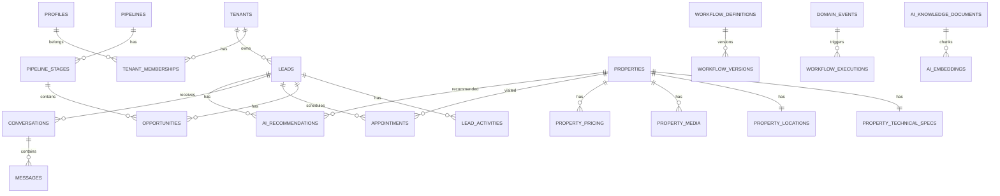

# InmoFlow CRM - FASE 3 - Modelo de Datos Completo

## 1. Objetivo de la fase

Definir el modelo de datos completo de InmoFlow CRM antes de generar SQL. Este documento establece entidades, campos conceptuales, relaciones, reglas multi-tenant, constraints, indices esperados, auditoria, IA tenant-scoped e integraciones.

Esta fase no genera migraciones SQL, politicas RLS ni codigo de backend/frontend. La implementacion SQL corresponde a FASE 4 y las politicas RLS a FASE 5.

## 2. Convenciones globales

### 2.1 Identificadores

Todas las tablas principales usaran identificadores UUID.

Campos estandar:

- `id`: UUID primario.
- `tenant_id`: UUID obligatorio en toda tabla de negocio tenant-scoped.
- `created_at`: fecha de creacion.
- `updated_at`: fecha de ultima actualizacion.
- `created_by`: usuario que creo el registro cuando aplique.
- `updated_by`: usuario que modifico el registro cuando aplique.
- `deleted_at`: soft delete cuando el dominio requiera recuperacion o auditoria operativa.

### 2.2 Multi-tenancy

Regla obligatoria:

- Toda tabla de negocio contiene `tenant_id`, excepto tablas estrictamente globales de identidad/control o tablas puente publicas con acceso mediado por token.
- Todo foreign key entre tablas tenant-scoped debe preservar el mismo `tenant_id`.
- Todo indice de consulta frecuente en tablas tenant-scoped empieza por `tenant_id`.
- Todo evento, log, mensaje, embedding, documento, job e integracion tiene `tenant_id`.

### 2.3 Estados y enums conceptuales

Los enums se definiran en SQL durante FASE 4. En esta fase se listan como tipos conceptuales:

- `membership_role`: `owner`, `admin`, `manager`, `agent`.
- `membership_status`: `invited`, `active`, `suspended`, `removed`.
- `lead_status`: `new`, `contacted`, `qualified`, `unqualified`, `converted`, `lost`, `reactivation`.
- `operation_type`: `sale`, `rent`, `temporary_rent`.
- `property_status`: `draft`, `available`, `reserved`, `sold`, `rented`, `paused`, `archived`.
- `appointment_status`: `scheduled`, `confirmed`, `completed`, `cancelled`, `no_show`.
- `task_status`: `open`, `in_progress`, `done`, `cancelled`.
- `message_direction`: `inbound`, `outbound`.
- `message_status`: `queued`, `sent`, `delivered`, `read`, `failed`, `cancelled`.
- `workflow_status`: `draft`, `active`, `paused`, `archived`.
- `workflow_execution_status`: `pending`, `running`, `succeeded`, `failed`, `cancelled`, `skipped`.
- `integration_provider`: `whatsapp`, `gmail`, `google_calendar`, `google_ads`, `meta_ads`, `zonaprop`, `argenprop`, `mercado_libre`.
- `integration_status`: `connected`, `expired`, `revoked`, `error`, `disabled`.
- `publication_status`: `draft`, `pending_validation`, `ready`, `published`, `failed`, `paused`, `unpublished`.
- `document_status`: `draft`, `generated`, `sent`, `signed`, `voided`, `archived`.

### 2.4 Datos JSON

Se permite JSONB solo para:

- Metadata de providers externos.
- Configuracion versionada de workflows.
- Campos variables de portales inmobiliarios.
- Payloads auditados y redaccion parcial.
- Preferencias configurables del tenant.

No se usa JSONB para evitar modelar entidades centrales como leads, propiedades, usuarios, tareas o mensajes.

## 3. Identity & Tenancy

### 3.1 `profiles`

Perfil extendido del usuario autenticado por Supabase Auth.

Campos:

- `id`: UUID, coincide con `auth.users.id`.
- `full_name`.
- `email`.
- `avatar_url`.
- `locale`.
- `timezone`.
- `last_login_at`.
- `created_at`.
- `updated_at`.

Relaciones:

- Uno a muchos con `tenant_memberships`.
- Uno a muchos con entidades auditadas mediante `created_by`, `updated_by` o `actor_user_id`.

Reglas:

- No contiene `tenant_id` porque representa identidad global.
- Los datos de negocio nunca se asocian solo a `profile`; siempre tambien a `tenant_id`.

### 3.2 `tenants`

Organizacion inmobiliaria cliente.

Campos:

- `id`.
- `name`.
- `legal_name`.
- `tax_id`.
- `slug`.
- `primary_email`.
- `primary_phone`.
- `website_url`.
- `logo_url`.
- `country`.
- `region`.
- `city`.
- `timezone`.
- `default_currency`.
- `settings`.
- `created_at`.
- `updated_at`.
- `deleted_at`.

Relaciones:

- Uno a muchos con todas las tablas tenant-scoped.
- Uno a muchos con `tenant_memberships`.

Constraints:

- `slug` unico global.
- `default_currency` obligatorio.
- `timezone` obligatorio.

### 3.3 `tenant_memberships`

Relacion usuario-tenant con rol y estado.

Campos:

- `id`.
- `tenant_id`.
- `user_id`.
- `role`.
- `status`.
- `invited_by`.
- `joined_at`.
- `suspended_at`.
- `removed_at`.
- `created_at`.
- `updated_at`.

Relaciones:

- Muchos a uno con `tenants`.
- Muchos a uno con `profiles`.

Constraints:

- Unico compuesto: `tenant_id`, `user_id`.
- `role` obligatorio.
- `status` obligatorio.

Indices:

- `tenant_id`, `status`.
- `user_id`, `status`.

### 3.4 `tenant_invitations`

Invitaciones a usuarios.

Campos:

- `id`.
- `tenant_id`.
- `email`.
- `role`.
- `token_hash`.
- `status`.
- `expires_at`.
- `accepted_at`.
- `accepted_by`.
- `invited_by`.
- `created_at`.
- `updated_at`.

Reglas:

- El token se guarda hasheado.
- Invitaciones expiradas no crean membresias.

### 3.5 `role_permissions`

Permisos configurables por rol y tenant.

Campos:

- `id`.
- `tenant_id`.
- `role`.
- `permission_key`.
- `enabled`.
- `created_at`.
- `updated_at`.

Constraints:

- Unico compuesto: `tenant_id`, `role`, `permission_key`.

## 4. CRM Leads

### 4.1 `lead_sources`

Origen configurable de leads.

Campos:

- `id`.
- `tenant_id`.
- `name`.
- `kind`: organic, referral, portal, ads, whatsapp, manual, import.
- `provider`.
- `external_id`.
- `is_active`.
- `created_at`.
- `updated_at`.

Constraints:

- Nombre unico por tenant.

### 4.2 `leads`

Entidad principal del CRM.

Campos:

- `id`.
- `tenant_id`.
- `source_id`.
- `assigned_agent_id`.
- `status`.
- `first_name`.
- `last_name`.
- `display_name`.
- `email`.
- `phone`.
- `normalized_phone`.
- `preferred_contact_channel`.
- `operation_type`.
- `budget_min`.
- `budget_max`.
- `currency`.
- `preferred_locations`.
- `property_type_interest`.
- `bedrooms_min`.
- `bathrooms_min`.
- `area_min`.
- `notes`.
- `score`.
- `last_contacted_at`.
- `next_follow_up_at`.
- `converted_at`.
- `lost_at`.
- `lost_reason`.
- `created_by`.
- `updated_by`.
- `created_at`.
- `updated_at`.
- `deleted_at`.

Relaciones:

- Muchos a uno con `lead_sources`.
- Muchos a uno con `profiles` como agente asignado.
- Uno a muchos con contactos, actividades, notas, oportunidades, conversaciones y recomendaciones.

Reglas:

- `assigned_agent_id` debe pertenecer al mismo tenant mediante membresia activa.
- `score` entre 0 y 100.
- Datos de contacto normalizados para deduplicacion.

Indices:

- `tenant_id`, `status`.
- `tenant_id`, `assigned_agent_id`.
- `tenant_id`, `normalized_phone`.
- `tenant_id`, `email`.
- `tenant_id`, `next_follow_up_at`.

### 4.3 `lead_contacts`

Canales de contacto adicionales.

Campos:

- `id`.
- `tenant_id`.
- `lead_id`.
- `type`: email, phone, whatsapp, instagram, other.
- `value`.
- `normalized_value`.
- `is_primary`.
- `verified_at`.
- `created_at`.
- `updated_at`.

Constraints:

- Unico compuesto recomendado: `tenant_id`, `lead_id`, `type`, `normalized_value`.

### 4.4 `lead_assignments`

Historial de asignaciones.

Campos:

- `id`.
- `tenant_id`.
- `lead_id`.
- `assigned_to`.
- `assigned_by`.
- `reason`.
- `assigned_at`.

Reglas:

- No se actualiza; es append-only.

### 4.5 `lead_activities`

Timeline de actividad del lead.

Campos:

- `id`.
- `tenant_id`.
- `lead_id`.
- `actor_user_id`.
- `activity_type`.
- `summary`.
- `metadata`.
- `occurred_at`.
- `created_at`.

Reglas:

- Append-only.
- Soporta eventos manuales, mensajes, cambios de etapa, visitas y automatizaciones.

### 4.6 `lead_notes`

Notas internas.

Campos:

- `id`.
- `tenant_id`.
- `lead_id`.
- `body`.
- `visibility`: private, team.
- `created_by`.
- `updated_by`.
- `created_at`.
- `updated_at`.
- `deleted_at`.

### 4.7 `lead_scores`

Historial de scoring.

Campos:

- `id`.
- `tenant_id`.
- `lead_id`.
- `score`.
- `reason`.
- `model_version`.
- `calculated_by`: system, ai, user.
- `created_at`.

Reglas:

- Append-only.

## 5. Sales Pipeline

### 5.1 `pipelines`

Pipelines configurables por tenant.

Campos:

- `id`.
- `tenant_id`.
- `name`.
- `description`.
- `is_default`.
- `is_active`.
- `created_by`.
- `updated_by`.
- `created_at`.
- `updated_at`.

Constraints:

- Maximo un pipeline default activo por tenant.

### 5.2 `pipeline_stages`

Etapas de un pipeline.

Campos:

- `id`.
- `tenant_id`.
- `pipeline_id`.
- `name`.
- `position`.
- `probability`.
- `is_won_stage`.
- `is_lost_stage`.
- `is_active`.
- `created_at`.
- `updated_at`.

Constraints:

- `position` unico por `tenant_id`, `pipeline_id`.
- `probability` entre 0 y 100.

### 5.3 `opportunities`

Oportunidades comerciales.

Campos:

- `id`.
- `tenant_id`.
- `lead_id`.
- `pipeline_id`.
- `stage_id`.
- `assigned_agent_id`.
- `property_id`.
- `title`.
- `operation_type`.
- `amount`.
- `currency`.
- `probability`.
- `expected_close_date`.
- `closed_at`.
- `lost_reason`.
- `created_by`.
- `updated_by`.
- `created_at`.
- `updated_at`.
- `deleted_at`.

Relaciones:

- Muchos a uno con lead.
- Muchos a uno con pipeline y stage.
- Opcional a property.

Indices:

- `tenant_id`, `pipeline_id`, `stage_id`.
- `tenant_id`, `assigned_agent_id`.
- `tenant_id`, `expected_close_date`.

### 5.4 `opportunity_stage_history`

Historial de cambios de etapa.

Campos:

- `id`.
- `tenant_id`.
- `opportunity_id`.
- `from_stage_id`.
- `to_stage_id`.
- `changed_by`.
- `reason`.
- `changed_at`.

Reglas:

- Append-only.

## 6. Properties

### 6.1 `properties`

Entidad principal del inmueble.

Campos:

- `id`.
- `tenant_id`.
- `code`.
- `title`.
- `description`.
- `property_type`.
- `operation_type`.
- `status`.
- `owner_name`.
- `owner_contact`.
- `internal_notes`.
- `featured`.
- `created_by`.
- `updated_by`.
- `created_at`.
- `updated_at`.
- `deleted_at`.

Constraints:

- `code` unico por tenant.
- `title` obligatorio.

Indices:

- `tenant_id`, `status`.
- `tenant_id`, `operation_type`.
- `tenant_id`, `property_type`.

### 6.2 `property_technical_specs`

Ficha tecnica completa.

Campos:

- `id`.
- `tenant_id`.
- `property_id`.
- `total_area`.
- `covered_area`.
- `semi_covered_area`.
- `land_area`.
- `rooms`.
- `bedrooms`.
- `bathrooms`.
- `toilets`.
- `garages`.
- `floors`.
- `floor_number`.
- `age_years`.
- `orientation`.
- `condition`.
- `amenities`.
- `services`.
- `expenses_amount`.
- `expenses_currency`.
- `created_at`.
- `updated_at`.

Constraints:

- Unico: `tenant_id`, `property_id`.
- Valores numericos no negativos.

### 6.3 `property_locations`

Ubicacion y geolocalizacion.

Campos:

- `id`.
- `tenant_id`.
- `property_id`.
- `country`.
- `region`.
- `city`.
- `neighborhood`.
- `street`.
- `street_number`.
- `unit`.
- `postal_code`.
- `latitude`.
- `longitude`.
- `geohash`.
- `show_exact_location`.
- `public_address`.
- `created_at`.
- `updated_at`.

Constraints:

- Unico: `tenant_id`, `property_id`.
- Latitud entre -90 y 90.
- Longitud entre -180 y 180.

Indices:

- `tenant_id`, `city`, `neighborhood`.
- `tenant_id`, `geohash`.

### 6.4 `property_media`

Imagenes, videos, planos y archivos.

Campos:

- `id`.
- `tenant_id`.
- `property_id`.
- `storage_path`.
- `media_type`.
- `title`.
- `alt_text`.
- `position`.
- `is_cover`.
- `metadata`.
- `created_by`.
- `created_at`.
- `updated_at`.

Reglas:

- `storage_path` debe estar prefijado por tenant.
- Solo un cover activo por property.

### 6.5 `property_pricing`

Precios y condiciones comerciales.

Campos:

- `id`.
- `tenant_id`.
- `property_id`.
- `operation_type`.
- `price`.
- `currency`.
- `period`: monthly, weekly, daily, total.
- `commission_terms`.
- `deposit_terms`.
- `is_active`.
- `valid_from`.
- `valid_to`.
- `created_by`.
- `created_at`.

Reglas:

- Historial append-friendly.
- Precio no negativo.

### 6.6 `property_availability`

Disponibilidad del inmueble.

Campos:

- `id`.
- `tenant_id`.
- `property_id`.
- `available_from`.
- `available_to`.
- `status`.
- `reason`.
- `created_at`.
- `updated_at`.

### 6.7 `property_publication_statuses`

Estado agregado de publicacion.

Campos:

- `id`.
- `tenant_id`.
- `property_id`.
- `portal`.
- `status`.
- `external_publication_id`.
- `last_published_at`.
- `last_synced_at`.
- `last_error`.
- `metadata`.
- `created_at`.
- `updated_at`.

Constraints:

- Unico: `tenant_id`, `property_id`, `portal`.

## 7. Portfolio Sharing

### 7.1 `portfolios`

Colecciones compartibles.

Campos:

- `id`.
- `tenant_id`.
- `name`.
- `description`.
- `lead_id`.
- `created_by`.
- `expires_at`.
- `is_active`.
- `created_at`.
- `updated_at`.
- `deleted_at`.

### 7.2 `portfolio_properties`

Propiedades incluidas en el portafolio.

Campos:

- `id`.
- `tenant_id`.
- `portfolio_id`.
- `property_id`.
- `position`.
- `notes`.
- `created_at`.

Constraints:

- Unico: `tenant_id`, `portfolio_id`, `property_id`.

### 7.3 `portfolio_share_links`

Links publicos firmados.

Campos:

- `id`.
- `tenant_id`.
- `portfolio_id`.
- `token_hash`.
- `expires_at`.
- `revoked_at`.
- `created_by`.
- `created_at`.

Reglas:

- Nunca guardar token en texto plano.
- La vista publica debe resolverse por token hasheado y expiracion.

### 7.4 `portfolio_view_events`

Auditoria de visualizaciones.

Campos:

- `id`.
- `tenant_id`.
- `portfolio_id`.
- `share_link_id`.
- `ip_hash`.
- `user_agent`.
- `viewed_at`.

## 8. Scheduling

### 8.1 `appointments`

Visitas a inmuebles.

Campos:

- `id`.
- `tenant_id`.
- `lead_id`.
- `property_id`.
- `assigned_agent_id`.
- `status`.
- `starts_at`.
- `ends_at`.
- `location_notes`.
- `meeting_url`.
- `notes`.
- `created_by`.
- `updated_by`.
- `created_at`.
- `updated_at`.
- `cancelled_at`.

Constraints:

- `ends_at` mayor que `starts_at`.

Indices:

- `tenant_id`, `assigned_agent_id`, `starts_at`.
- `tenant_id`, `property_id`, `starts_at`.

### 8.2 `calendar_events`

Eventos internos y sincronizados.

Campos:

- `id`.
- `tenant_id`.
- `appointment_id`.
- `task_id`.
- `owner_user_id`.
- `title`.
- `description`.
- `starts_at`.
- `ends_at`.
- `timezone`.
- `external_provider`.
- `external_event_id`.
- `sync_status`.
- `metadata`.
- `created_at`.
- `updated_at`.

### 8.3 `tasks`

Tareas operativas.

Campos:

- `id`.
- `tenant_id`.
- `lead_id`.
- `property_id`.
- `opportunity_id`.
- `assigned_to`.
- `created_by`.
- `title`.
- `description`.
- `status`.
- `priority`.
- `due_at`.
- `completed_at`.
- `created_at`.
- `updated_at`.
- `deleted_at`.

Indices:

- `tenant_id`, `assigned_to`, `status`, `due_at`.

### 8.4 `reminders`

Recordatorios.

Campos:

- `id`.
- `tenant_id`.
- `user_id`.
- `lead_id`.
- `task_id`.
- `appointment_id`.
- `remind_at`.
- `channel`.
- `status`.
- `sent_at`.
- `created_at`.
- `updated_at`.

## 9. Communications

### 9.1 `communication_channels`

Canales conectados por tenant.

Campos:

- `id`.
- `tenant_id`.
- `provider`.
- `display_name`.
- `external_account_id`.
- `status`.
- `created_by`.
- `created_at`.
- `updated_at`.

### 9.2 `conversations`

Conversaciones con leads o contactos.

Campos:

- `id`.
- `tenant_id`.
- `lead_id`.
- `channel_id`.
- `assigned_agent_id`.
- `subject`.
- `status`.
- `last_message_at`.
- `created_at`.
- `updated_at`.

Indices:

- `tenant_id`, `lead_id`.
- `tenant_id`, `channel_id`, `last_message_at`.

### 9.3 `messages`

Mensajes inbound/outbound.

Campos:

- `id`.
- `tenant_id`.
- `conversation_id`.
- `lead_id`.
- `channel_id`.
- `direction`.
- `status`.
- `sender_user_id`.
- `external_message_id`.
- `from_address`.
- `to_address`.
- `body_text`.
- `body_html`.
- `attachments`.
- `provider_payload_redacted`.
- `sent_at`.
- `delivered_at`.
- `read_at`.
- `failed_at`.
- `failure_reason`.
- `created_at`.
- `updated_at`.

Reglas:

- Payload externo siempre redaccionado.
- Attachments referencian storage tenant-scoped.

### 9.4 `message_templates`

Plantillas de mensajes.

Campos:

- `id`.
- `tenant_id`.
- `name`.
- `channel_provider`.
- `language`.
- `subject`.
- `body`.
- `external_template_id`.
- `approval_status`.
- `created_by`.
- `updated_by`.
- `created_at`.
- `updated_at`.
- `deleted_at`.

### 9.5 `outbound_message_jobs`

Cola persistida de envios.

Campos:

- `id`.
- `tenant_id`.
- `message_id`.
- `provider`.
- `idempotency_key`.
- `status`.
- `attempt_count`.
- `next_attempt_at`.
- `last_error`.
- `created_at`.
- `updated_at`.

Constraints:

- `idempotency_key` unico por tenant.

## 10. Automation & Workflows

### 10.1 `workflow_definitions`

Definicion logica de workflow.

Campos:

- `id`.
- `tenant_id`.
- `name`.
- `description`.
- `status`.
- `current_version_id`.
- `created_by`.
- `updated_by`.
- `created_at`.
- `updated_at`.
- `deleted_at`.

### 10.2 `workflow_versions`

Version inmutable del workflow.

Campos:

- `id`.
- `tenant_id`.
- `workflow_id`.
- `version_number`.
- `definition`.
- `published_at`.
- `published_by`.
- `created_at`.

Reglas:

- `definition` contiene nodos, edges, triggers, condiciones y acciones.
- Una version publicada no se modifica.

### 10.3 `workflow_triggers`

Triggers indexables.

Campos:

- `id`.
- `tenant_id`.
- `workflow_id`.
- `workflow_version_id`.
- `event_type`.
- `filters`.
- `is_active`.
- `created_at`.
- `updated_at`.

### 10.4 `domain_events`

Eventos de dominio persistidos.

Campos:

- `id`.
- `tenant_id`.
- `event_type`.
- `aggregate_type`.
- `aggregate_id`.
- `payload`.
- `occurred_at`.
- `processed_at`.
- `created_at`.

Indices:

- `tenant_id`, `event_type`, `occurred_at`.
- `tenant_id`, `processed_at`.

### 10.5 `workflow_executions`

Ejecuciones de workflow.

Campos:

- `id`.
- `tenant_id`.
- `workflow_id`.
- `workflow_version_id`.
- `trigger_event_id`.
- `status`.
- `idempotency_key`.
- `started_at`.
- `finished_at`.
- `error_message`.
- `created_at`.
- `updated_at`.

Constraints:

- `idempotency_key` unico por tenant.

### 10.6 `workflow_node_executions`

Ejecuciones por nodo.

Campos:

- `id`.
- `tenant_id`.
- `workflow_execution_id`.
- `node_id`.
- `node_type`.
- `status`.
- `input`.
- `output`.
- `attempt_count`.
- `started_at`.
- `finished_at`.
- `error_message`.
- `created_at`.
- `updated_at`.

## 11. AI

### 11.1 `ai_knowledge_documents`

Documentos usados como conocimiento del tenant.

Campos:

- `id`.
- `tenant_id`.
- `source_type`.
- `source_id`.
- `title`.
- `content_hash`.
- `storage_path`.
- `status`.
- `metadata`.
- `created_by`.
- `created_at`.
- `updated_at`.

### 11.2 `ai_embeddings`

Embeddings tenant-scoped.

Campos:

- `id`.
- `tenant_id`.
- `knowledge_document_id`.
- `source_type`.
- `source_id`.
- `chunk_index`.
- `chunk_text`.
- `embedding`.
- `embedding_model`.
- `metadata`.
- `created_at`.

Reglas:

- Toda busqueda vectorial filtra por `tenant_id`.
- No existen embeddings globales con datos de tenants.

### 11.3 `ai_conversations`

Conversaciones con IA.

Campos:

- `id`.
- `tenant_id`.
- `lead_id`.
- `user_id`.
- `title`.
- `purpose`.
- `created_at`.
- `updated_at`.

### 11.4 `ai_messages`

Mensajes de conversaciones IA.

Campos:

- `id`.
- `tenant_id`.
- `conversation_id`.
- `role`: user, assistant, system, tool.
- `content`.
- `token_count`.
- `metadata`.
- `created_at`.

### 11.5 `ai_recommendations`

Recomendaciones generadas.

Campos:

- `id`.
- `tenant_id`.
- `lead_id`.
- `property_id`.
- `recommendation_type`.
- `score`.
- `reason`.
- `model_version`.
- `accepted_at`.
- `rejected_at`.
- `created_at`.

Constraints:

- `score` entre 0 y 100.

### 11.6 `ai_generation_logs`

Registro auditado de generaciones.

Campos:

- `id`.
- `tenant_id`.
- `user_id`.
- `lead_id`.
- `purpose`.
- `provider`.
- `model`.
- `prompt_hash`.
- `input_redacted`.
- `output_redacted`.
- `token_input_count`.
- `token_output_count`.
- `duration_ms`.
- `status`.
- `error_message`.
- `created_at`.

Reglas:

- No guardar secretos.
- Redactar PII cuando no sea necesaria para auditoria.

## 12. Documents

### 12.1 `document_templates`

Plantillas documentales.

Campos:

- `id`.
- `tenant_id`.
- `name`.
- `document_type`: contract, receipt, reservation, other.
- `body`.
- `variables_schema`.
- `is_active`.
- `created_by`.
- `updated_by`.
- `created_at`.
- `updated_at`.
- `deleted_at`.

### 12.2 `documents`

Documentos generados.

Campos:

- `id`.
- `tenant_id`.
- `template_id`.
- `lead_id`.
- `property_id`.
- `opportunity_id`.
- `document_type`.
- `status`.
- `title`.
- `storage_path`.
- `data_snapshot`.
- `generated_by`.
- `created_at`.
- `updated_at`.
- `deleted_at`.

### 12.3 `document_versions`

Versiones de documentos.

Campos:

- `id`.
- `tenant_id`.
- `document_id`.
- `version_number`.
- `storage_path`.
- `data_snapshot`.
- `created_by`.
- `created_at`.

### 12.4 `document_signing_requests`

Solicitudes de firma futura.

Campos:

- `id`.
- `tenant_id`.
- `document_id`.
- `provider`.
- `external_request_id`.
- `status`.
- `sent_at`.
- `completed_at`.
- `metadata`.
- `created_at`.
- `updated_at`.

## 13. Marketing & Ads

### 13.1 `integration_connections`

Conexion de proveedor externo por tenant.

Campos:

- `id`.
- `tenant_id`.
- `provider`.
- `display_name`.
- `external_account_id`.
- `status`.
- `scopes`.
- `connected_by`.
- `connected_at`.
- `last_error`.
- `created_at`.
- `updated_at`.

Constraints:

- Unico recomendado: `tenant_id`, `provider`, `external_account_id`.

### 13.2 `integration_tokens`

Tokens cifrados de integraciones.

Campos:

- `id`.
- `tenant_id`.
- `connection_id`.
- `access_token_encrypted`.
- `refresh_token_encrypted`.
- `expires_at`.
- `rotation_required_at`.
- `created_at`.
- `updated_at`.

Reglas:

- Nunca accesible desde cliente.
- RLS y permisos extremadamente restrictivos.

### 13.3 `integration_sync_states`

Estado de sincronizacion incremental.

Campos:

- `id`.
- `tenant_id`.
- `connection_id`.
- `resource_type`.
- `cursor`.
- `last_synced_at`.
- `last_success_at`.
- `last_error`.
- `created_at`.
- `updated_at`.

### 13.4 `ad_accounts`

Cuentas publicitarias.

Campos:

- `id`.
- `tenant_id`.
- `connection_id`.
- `provider`.
- `external_account_id`.
- `name`.
- `currency`.
- `timezone`.
- `status`.
- `created_at`.
- `updated_at`.

### 13.5 `campaigns`

Campañas importadas.

Campos:

- `id`.
- `tenant_id`.
- `ad_account_id`.
- `provider`.
- `external_campaign_id`.
- `name`.
- `status`.
- `objective`.
- `budget_amount`.
- `currency`.
- `starts_at`.
- `ends_at`.
- `metrics`.
- `created_at`.
- `updated_at`.

### 13.6 `ad_lead_imports`

Leads importados desde ads.

Campos:

- `id`.
- `tenant_id`.
- `provider`.
- `campaign_id`.
- `external_lead_id`.
- `lead_id`.
- `payload_redacted`.
- `imported_at`.
- `created_at`.

Constraints:

- Unico: `tenant_id`, `provider`, `external_lead_id`.

## 14. Publishing

### 14.1 `portal_connections`

Conexiones a portales inmobiliarios.

Campos:

- `id`.
- `tenant_id`.
- `provider`.
- `display_name`.
- `external_account_id`.
- `status`.
- `metadata`.
- `connected_by`.
- `created_at`.
- `updated_at`.

### 14.2 `portal_publications`

Publicaciones por portal.

Campos:

- `id`.
- `tenant_id`.
- `property_id`.
- `portal_connection_id`.
- `provider`.
- `status`.
- `external_publication_id`.
- `validation_errors`.
- `published_payload`.
- `published_at`.
- `unpublished_at`.
- `last_synced_at`.
- `last_error`.
- `created_at`.
- `updated_at`.

Constraints:

- Unico: `tenant_id`, `property_id`, `provider`, `portal_connection_id`.

## 15. Analytics & Audit

### 15.1 `audit_logs`

Auditoria de acciones sensibles.

Campos:

- `id`.
- `tenant_id`.
- `actor_user_id`.
- `action`.
- `entity_type`.
- `entity_id`.
- `before_redacted`.
- `after_redacted`.
- `ip_address`.
- `user_agent`.
- `correlation_id`.
- `created_at`.

Reglas:

- Append-only.
- Redaccion de secretos y tokens.

Indices:

- `tenant_id`, `created_at`.
- `tenant_id`, `entity_type`, `entity_id`.
- `tenant_id`, `actor_user_id`, `created_at`.

### 15.2 `rate_limit_events`

Eventos de rate limiting.

Campos:

- `id`.
- `tenant_id`.
- `user_id`.
- `ip_hash`.
- `scope`.
- `limit_key`.
- `count`.
- `window_start`.
- `window_end`.
- `blocked`.
- `created_at`.

### 15.3 `system_logs`

Logs operativos estructurados.

Campos:

- `id`.
- `tenant_id`.
- `user_id`.
- `correlation_id`.
- `module`.
- `operation`.
- `severity`.
- `message`.
- `metadata_redacted`.
- `duration_ms`.
- `created_at`.

### 15.4 `analytics_snapshots`

Snapshots agregados para dashboard.

Campos:

- `id`.
- `tenant_id`.
- `snapshot_type`.
- `period_start`.
- `period_end`.
- `metrics`.
- `created_at`.

Constraints:

- Unico: `tenant_id`, `snapshot_type`, `period_start`, `period_end`.

## 16. Relaciones principales



## 17. Indices obligatorios por patron

Toda tabla tenant-scoped tendra indice por:

- `tenant_id`.
- `tenant_id`, `created_at` cuando se liste por fecha.
- `tenant_id`, `updated_at` cuando se sincronice.
- `tenant_id`, claves externas principales.
- `tenant_id`, campos de estado.

Indices especificos:

- Leads: estado, agente, telefono normalizado, email, proximo seguimiento.
- Propiedades: estado, operacion, tipo, zona, geohash.
- Oportunidades: pipeline, stage, agente, cierre esperado.
- Mensajes: conversacion, canal, estado, fecha.
- Workflows: evento, estado, idempotency key.
- Integraciones: provider, external IDs, sync cursors.
- Audit logs: entidad, actor, fecha.
- Embeddings: vector index filtrado por tenant en FASE 4.

## 18. Constraints multi-tenant

Reglas para FASE 4:

1. `tenant_id` NOT NULL en toda tabla tenant-scoped.
2. Foreign keys compuestas cuando sea necesario para impedir referencias cruzadas entre tenants.
3. Unique constraints siempre incluyen `tenant_id`, salvo identificadores globales controlados como `tenants.slug`.
4. Check constraints para rangos: score, probability, latitud, longitud, precios y cantidades.
5. Soft delete no elimina auditoria ni eventos historicos.

## 19. Storage tenant-scoped

Buckets previstos:

- `property-media`.
- `documents`.
- `ai-knowledge`.
- `message-attachments`.
- `tenant-assets`.

Regla de path:

```text
tenant/{tenant_id}/{resource_type}/{resource_id}/{file_name}
```

Las tablas que referencian archivos guardan `storage_path` y siempre incluyen `tenant_id`.

## 20. Datos publicos controlados

Portafolios compartibles:

- No hacen publicas las tablas de propiedades.
- Se accede mediante `portfolio_share_links`.
- El token se guarda hasheado.
- Se valida expiracion y revocacion.
- Se registra visualizacion.
- Solo se muestran propiedades incluidas en `portfolio_properties`.

## 21. Retencion y auditoria

Datos append-only:

- `audit_logs`.
- `lead_assignments`.
- `lead_activities`.
- `lead_scores`.
- `opportunity_stage_history`.
- `domain_events`.
- `workflow_versions` publicadas.
- `workflow_executions`.
- `ai_generation_logs`.

Datos con soft delete recomendado:

- Leads.
- Propiedades.
- Tareas.
- Documentos.
- Plantillas.
- Workflows.
- Portafolios.

## 22. Criterios de cierre de FASE 3

FASE 3 queda completa cuando:

1. El modelo de datos esta definido por dominio.
2. Todas las entidades de negocio incluyen `tenant_id`.
3. Estan descritas relaciones principales.
4. Estan descritos indices esperados.
5. Estan descritos constraints multi-tenant.
6. Esta definido el modelo para IA tenant-scoped.
7. Esta definido el modelo para integraciones reales.
8. Esta definido el modelo para auditoria, logs y rate limiting.
9. No se genero SQL.
10. No se genero codigo de backend/frontend.
11. No se generaron mocks, placeholders, funciones vacias ni integraciones falsas.

## 23. Estado

FASE 3 completada.

Siguiente fase permitida: FASE 4 - Generar esquema SQL de Supabase.
